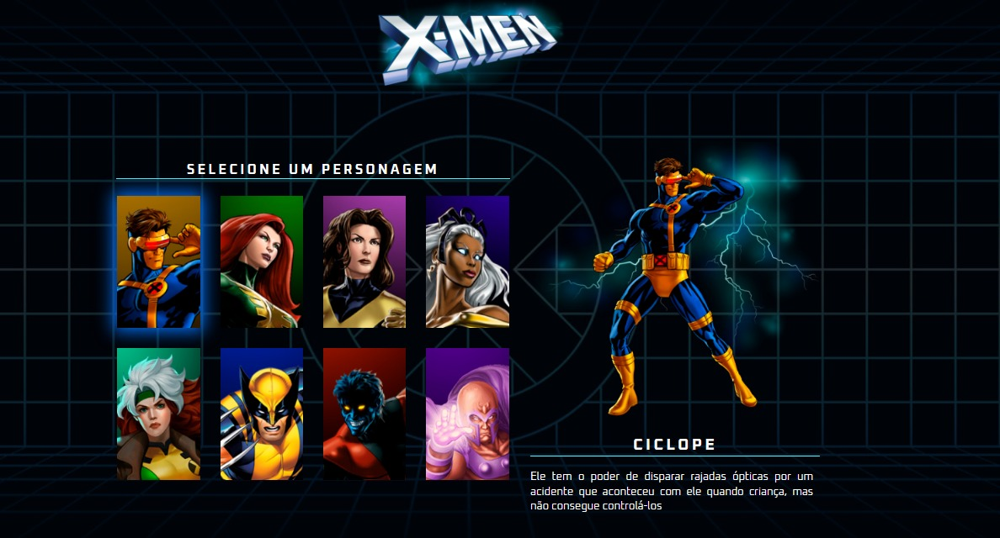

# x-men-szpc
# KlausFicharioSebrae

<h1 align="center"> Fichário de Estudos </h1>

Programa exclusivo e gratuito, promovido por Claudio Geovane, para agregar em seu portfólio, aprendido por meio do curso oferecido do DevEmDobro 
<a href="https://github.com/devemdobro">DevEmDobro<a/>   

  <a href="#-tecnologias">Sebrae</a>&nbsp;&nbsp;&nbsp;|&nbsp;&nbsp;&nbsp;
  <a href="#-projeto">Projeto</a>&nbsp;&nbsp;&nbsp;|&nbsp;&nbsp;&nbsp;
  <a href="#-layout">Layout</a>&nbsp;&nbsp;&nbsp;|&nbsp;&nbsp;&nbsp;
  <a href="#memo-licença">Licença</a>

  

 

  

## 🚀 Tecnologias

Esse projeto foi desenvolvido com as seguintes tecnologias:

- HTML e CSS
- JavaScript
- Git e Github

## 💻 Projeto

## :memo: Licença

Esse projeto está sob a licença MIT.
